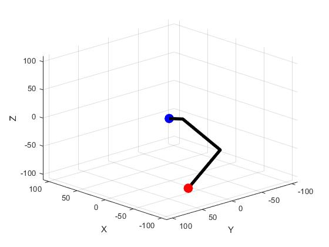
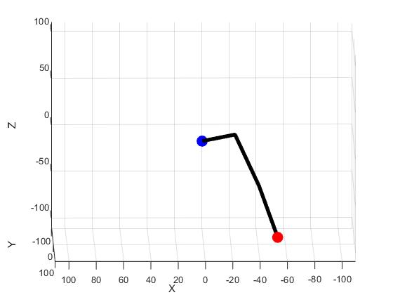
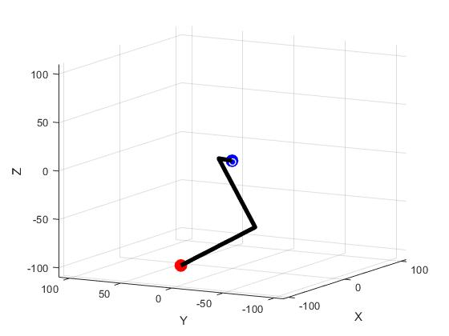
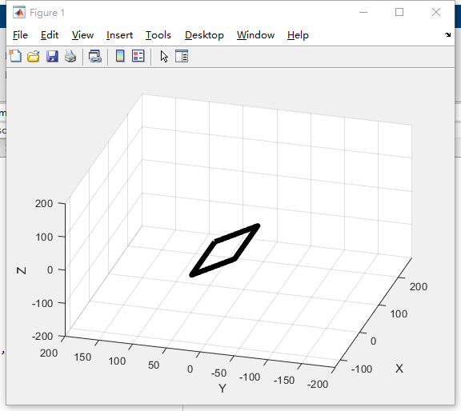
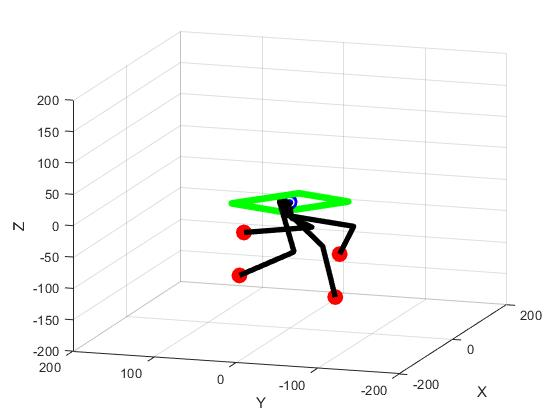
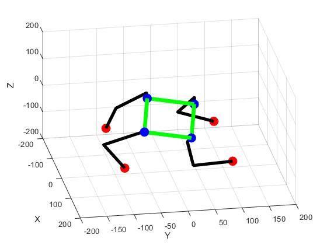
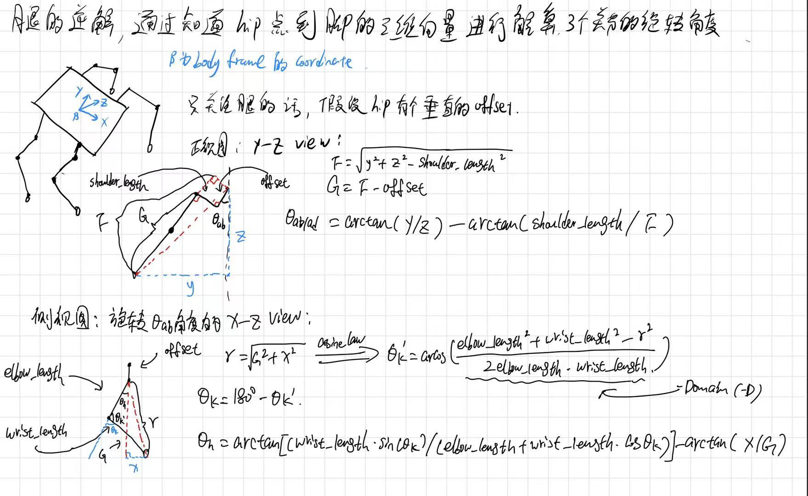
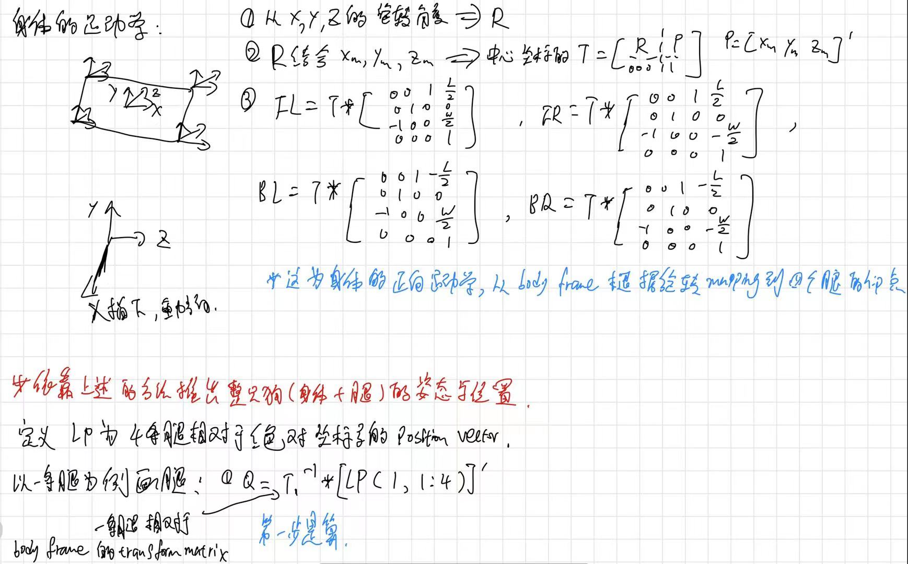

# Kinematics Simulation or Visualization (MATLAB)
_______________________________
> **This repo is help to understand the kinematics of a standard three linked leg strcture robot dog with the graphical approach.**  

## File Description
>legKinematic： this could help to calcualate the joint angle if you have a **hip-to-foot position vector** in the the hip joint coordinate, the **three joint angles** of a leg could be calculated.
To visualize the data, the angles will be further transferd to the joint positions and use the matlab plot3 tool to obtain the 3d graph.
 
 
________________________________________________________________________________
>bodyKinematic： this one is basically using the rotational matrix and homogenious transform matrix to change the global coordinate to the desired four hip joints transform matrix. Then the dog's **orientaion and position** could be adjusted with the user input to gengerate the responding **four leg space coordinate**

__________________________________________________________________________________________
>kinematicSimulation: this file is just for visualzation to combine the two kinematic solver above
~~**has some bugs when drawing legs in the different hip joints**, will resolve it later on~~
`wrong transformation bug to draw the leg in the global frame`

-----------------------------------------------------------------------
#**correct calculation result:**

## Kinematic Explaination

---------------------------------------------------------------

###
`Each file has a test case for you to visualize the calculation result`